# Feel Weather

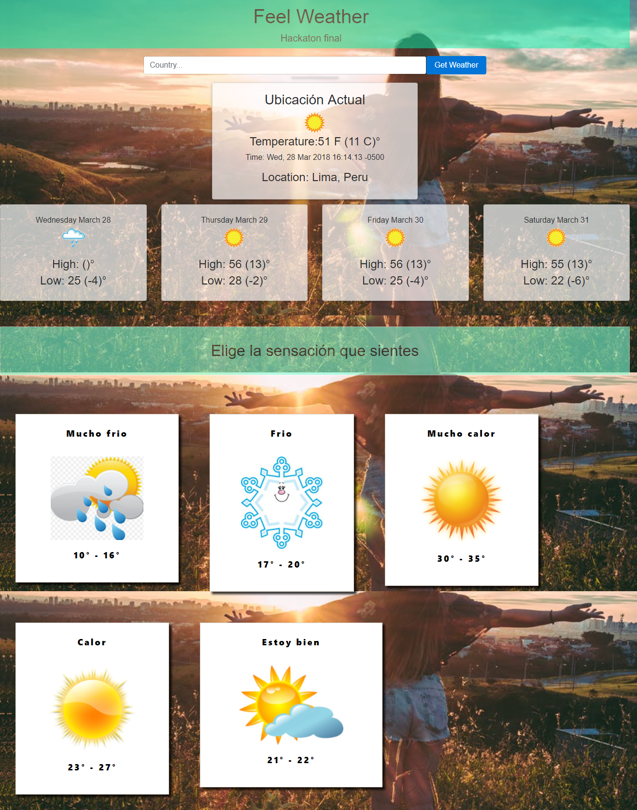

Es una aplicación móvil que te permitirá conocer sobre el clima en distintos lugares del país y, además, podrás recibir sugerencias cuando te hayas unido a la aplicación. ¿En qué consisten estas sugerencias? En poder decirte como te vas a sentir respecto a ciertos grados de temperatura. 

Track: Hackaton final de bootcamp.

Alumnas:

* Eleyne Ramirez De la Cruz - Front End Developer.
* Vanessa Mendoza Inoñan - Front End Developer
* Lesly Nomberto Coronado - Front End Developer. 
* Rocio Quilla - UX Designer.

------------

## Reto

Crea una app para chequear las condiciones del clima y compararlas com la perceción individual del usuario, puedes usar cualquier API de clima para ayudarte.
La idea es que todos los días muestre cómo será el clima del día y le pregunte al suario cómo siente el clima (percepción), por ejemplo: "tengo frío", "tengo mucho frío", "Me derrito de calor", "Está perfecto", etc.
La app deberá guardar las respuestas para luego relacionarlas con el pronóstico y decirte cómo se sentirá el usuario ese día.

## Productos

Para este reto en el cual recién empezamos a trabajar de la mano tanto Front End como UX, decidimos tener dos productos para este reto. El primero es el de UX, un prototipo en alta fidelidad que nos muestra como sería la aplicación. El segundo es el de Front End, un producto en el cual ya se puede observar las funcionalidades pedidas.

## Proceso UX

El proceso UX estuvo a cargo de Rocio Quilla, aquí detallaremos la investigación, ideación y creación del demo sobre la app del clima.

### Investigación

Para poder conocer más a fondo el tema y encontrar una necesidad, se desarrolló una encuesta,entrevistas personales y un benchmarking sobre 4 aplicaciones del clima.

#### Encuestas

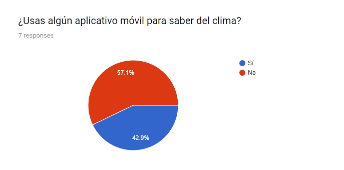
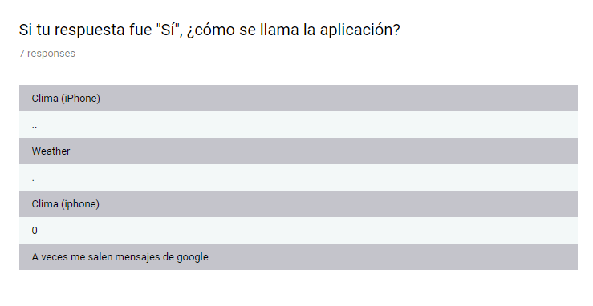
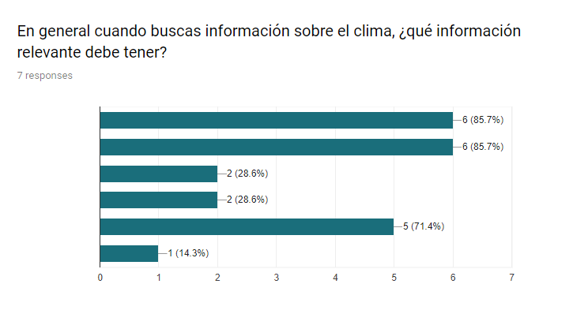
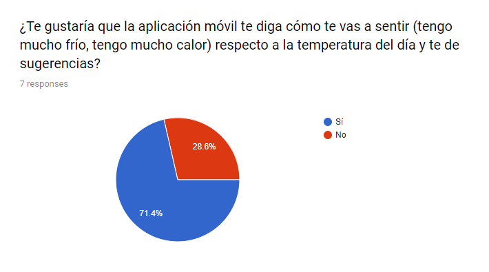

* **Outputs**

  * Las personas sí usan o están familiarizadas con una aplicación del clima.
  * Usan aplicaciones que vienen ya instaladas en el celular.
  * Desearían recibir sugerencias respecto al clima en un futuro.

#### Entrevistas Personales

Se usó una guía de entrevistas:

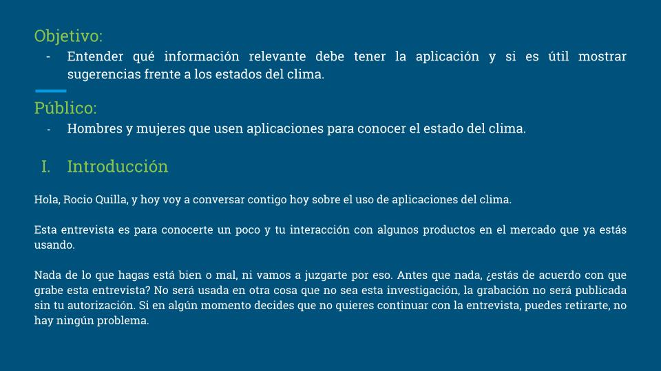
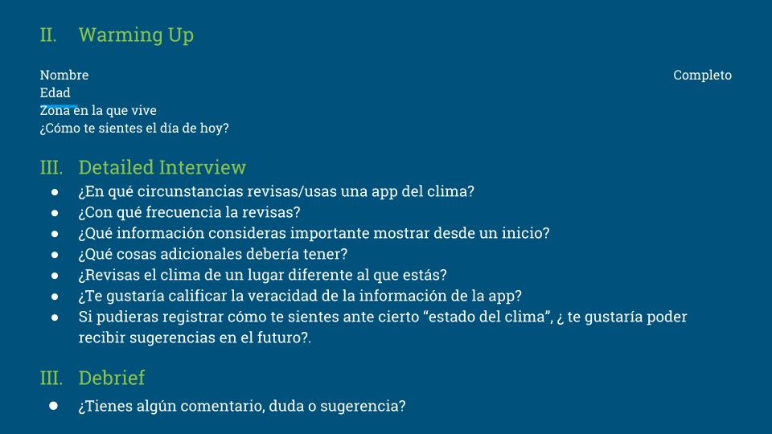

* **Outputs**

  * Usan las aplicaciones de clima sobre todo cuando viajan.
  * La información que priorizan es la temperatura, estado de clima y si lloverá o no (aplica solo para lugares en los que la lluvia es frecuente).
  * Revisan información sobre el clima de un lugar diferente al que se encuentran.

#### Benchmarking

Se realizó un benchmarking con 4 populares aplicaciones del clima:

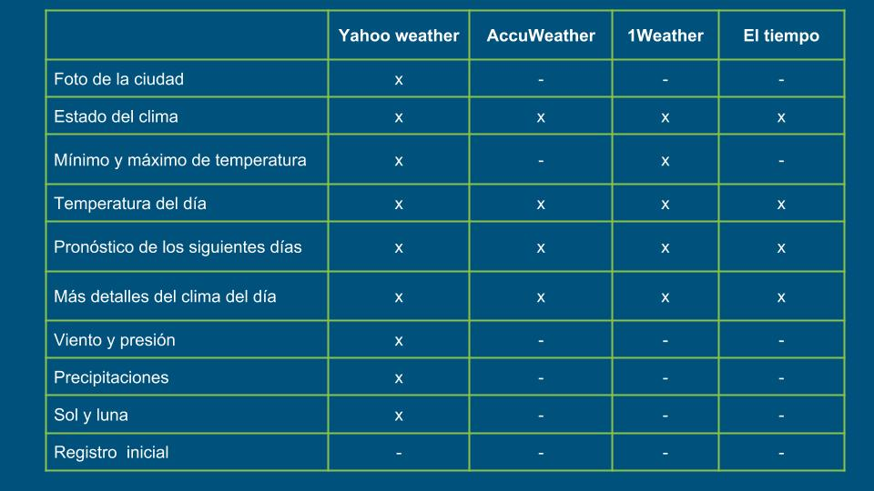

* **Outputs**

  * Solo una aplicación muestra foto del lugar en el que se encuentra el usuario o el lugar que está buscando en la aplicación.
  * Todas muestran el estado del clima, pronóstico, temperatura y detalles adicionales.
  * Solo una aplicación nos muestra detalles como las precipitaciones, vientos, la posición lunar, etc.

### Síntesis e Ideación

Se observó que no era necesario realizar un mapa de afinidad ya que tanto las encuestas como las entrevistas presenciales nos daban resultados medibles de forma numérica.

#### User primary person

* Nombre: Angela Miroquezada.
* Edad: 22 años
* Ocupación: Estudiante.
* Carrera: Administración de Negocios Internacionales.
* Universidad: USIL.
* Trabajo: Sheraton Lima Hotel & Convention Center.
* Frases: “Soy muy perceptiva con respecto al clima sobretodo cuando viajo. Normalmente viajo a lugares con climas muy cambiantes y por eso uso estas aplicaciones.”

#### MPV

Nuestro producto será una aplicación mobile que pueda mostrarte el clima del lugar donde te encuentras, buscar y pronosticar los estados del clima para dias futuros.

### Prototipo

Se realizó prototipos de baja fidelidad y alta fidelidad.

#### Paper prototyping

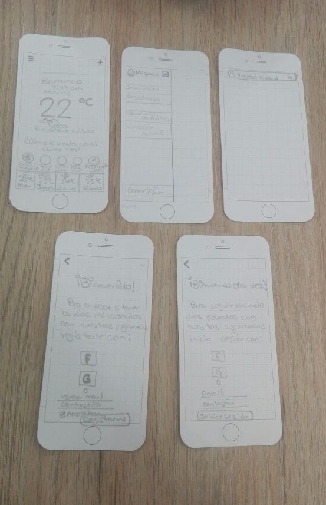

El cual se testeo con 2 personas, algunas observaciones que se realizaron fueron:

* "Regitrarse desde el inicio de descarga de la aplicación porque me fastidia tener que registrarme despues"

* "Me gusta que no tenga que registrarme y que pueda ver el clima desde el inicio"

#### Digital prototyping

Con el feedback recibido se realizó este prototipo de alta fidelidad, nuestra aplicación se llama [Feel Weather](https://invis.io/C6GKDIUKZVD "titulo")

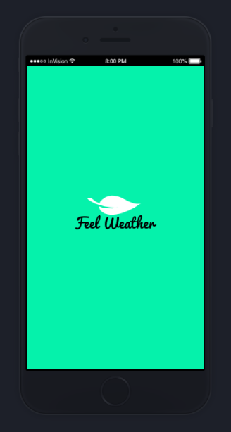

## Proceso Front End

El proceso de Front End estuvo a cargo de Vanessa Mendoza, Eleyne Ramirez y Leslie Nomberto. 

### Herramientas usadas:

* Bootstrap
* React
* HTML 5
* CSS
* API Wonderground

### Funcionalidad:

* Obtener sensación del clima del usuario.
* Sensación del usuario igualar con API del clima.
* Mostrar como se sentirá el usuario.

### Elaboración:

Se trabajo en equipo para obtener los datos del usuario desde la API para posteriormente guardalos en el Local Storage.

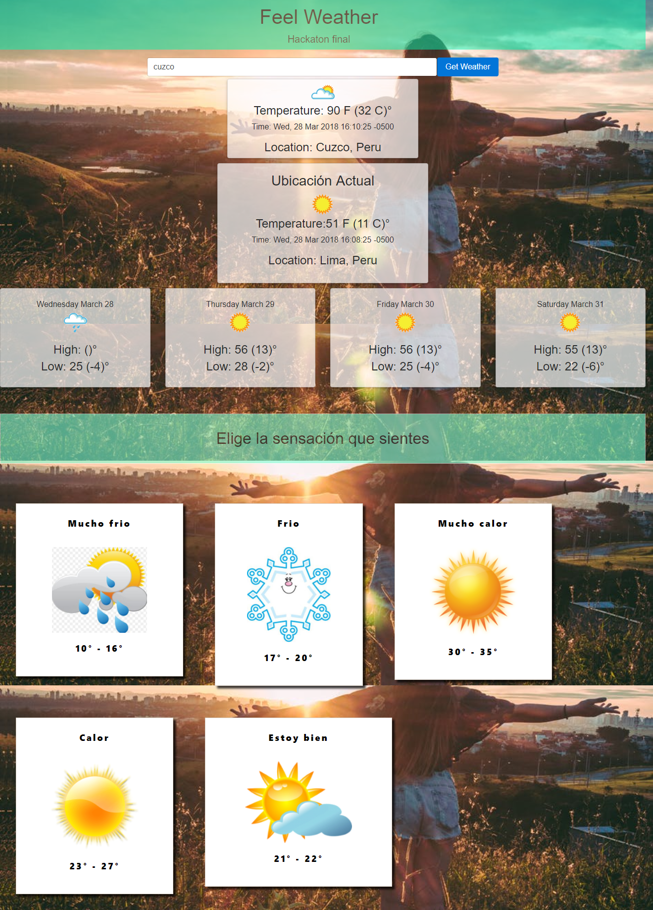

